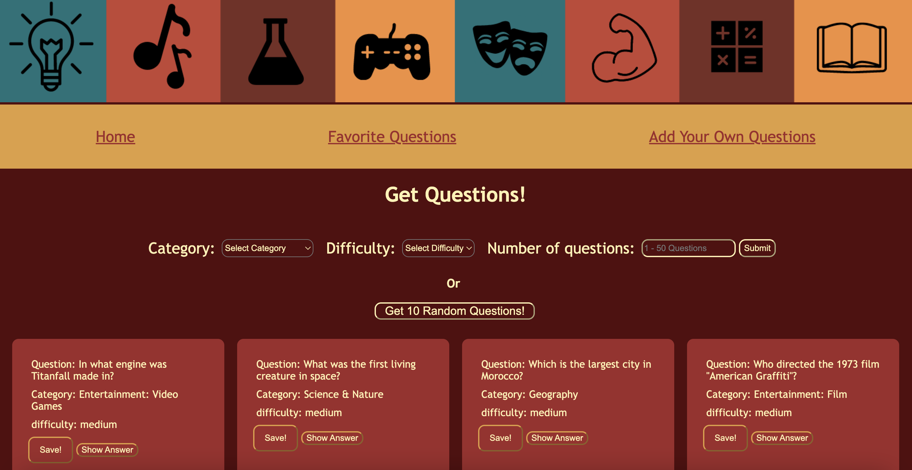

# Project-2-Random-Questions

Random Questions App is an app that can generate random trivia questions, as well as allow users to select favorite questions and add their own ones.

## User is able to:
1. Generate random questions.
2. Filter the questions by category and difficulty level.
3. View the answer for the question.
4. Add new questions via form submission.
5. Favorite questions.

## Deliverables:
1. On page load user will see categories and difficulties to select from in order to generate questions
2. When submitting the filter form, the questions should be displayed
3. When clicking ‘show answer’, the answer should appear
4. Create a form that allows the user to add their own questions
5. When clicking ‘save’, the question is marked as saved

## Owners:
* [Mariia Honcharenko](https://github.com/mmmaariieee)
* [Trevor Perry](https://github.com/TrevorPerry14)
* [Adriel Puello](https://github.com/adrielpuello)